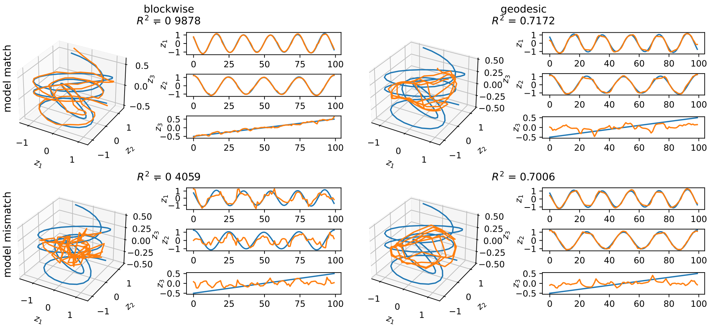

# Inverse Kernel Decomposition (TMLR 2024)

<div align='center' >Chengrui Li and Anqi Wu</div>

[[paper]](https://openreview.net/pdf?id=H4OE7toXpa)  [[arXiv]](https://arxiv.org/abs/2211.05961) [[code]](https://github.com/JerrySoybean/ikd)  [[slides]](/assets/pdf/IKD%20pre.pdf)  [[文章]](/assets/pdf/IKD_TMLR_中文.pdf)



## 1 Installation
From the current directory (which includes this `README.md`), run
```
cd ikd
pip install -e .
```

## 2 Tutorial
`demo.ipynb` in `ikd` is a step-by-step tutorial that run PCA, GPLVM, and IKD on a synthetic dataset.
